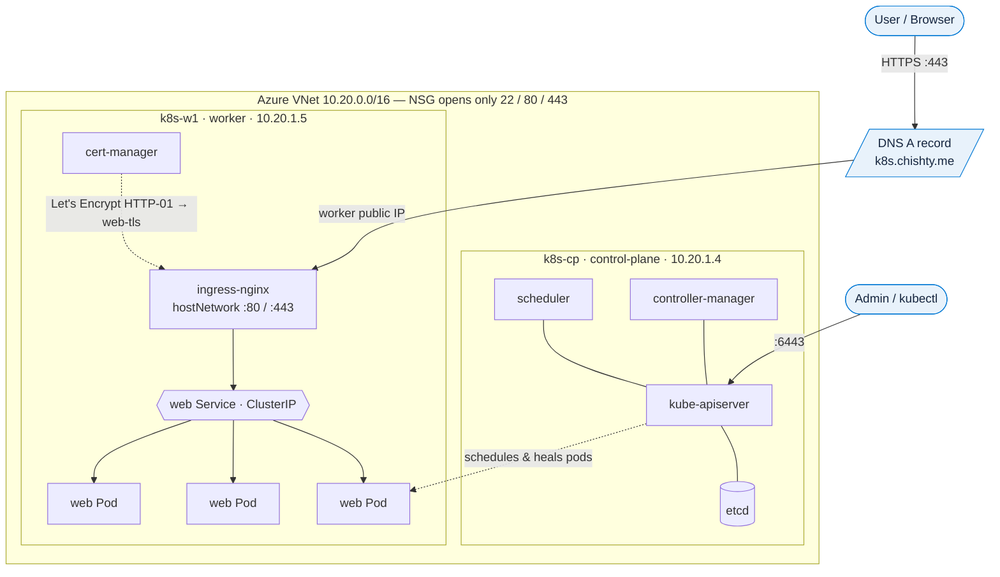

# Self-Managed Kubernetes on Azure with `kubeadm`

> A production-shaped, **two-node Kubernetes cluster built by hand** on Azure VMs — no managed control plane, no shortcuts. A containerized app is exposed to the internet through an NGINX Ingress and secured with an **automatic Let's Encrypt TLS certificate** on a real domain: **https://k8s.chishty.me**.


-FF6D5A)


---

## Why this project

Anyone can run `az aks create` and get a cluster. This project is the opposite: I **bootstrapped the control plane myself with `kubeadm`**, installed the container runtime and pod network, joined a worker node, and wired up ingress and TLS on bare ports — so I understand what a managed service like AKS/EKS actually does for you, and what every moving part is for. Along the way I hit and **debugged five real infrastructure failures** (documented in [`docs/02-troubleshooting.md`](docs/02-troubleshooting.md)) — which is the part that mirrors the actual job.

**Live result:** `curl -I https://k8s.chishty.me` → `HTTP/2 200` with a valid Let's Encrypt certificate and HSTS.

---

## Architecture



**Request path:** browser → DNS → worker `:443` (ingress-nginx, `hostNetwork`) → TLS terminate → Ingress rule (host `k8s.chishty.me`) → Service (load-balances by label) → one of the `web` Pods.

More detail + a request-path sequence diagram: [`docs/03-architecture.md`](docs/03-architecture.md).

---

## What this demonstrates (skills)

| Area | Concretely, in this repo |
|------|--------------------------|
| **Cloud / IaaS** | Provisioned VNet, subnet, NSG (least-privilege: only 22/80/443 public), and VMs via Azure CLI |
| **Linux / runtime** | Node prep by hand: swap, kernel modules, sysctls, **containerd** with the systemd cgroup driver |
| **Kubernetes core** | `kubeadm init/join`, kubeconfig, Namespaces, Deployments, ReplicaSets, Services, **Ingress** |
| **Networking (CNI)** | **Calico**, and switching IP-in-IP → **VXLAN** because Azure drops IPIP between VMs |
| **Config & secrets** | `ConfigMap` and `Secret` injected as env vars; probes; resource requests/limits |
| **Ingress & TLS** | NGINX Ingress on `hostNetwork`; **cert-manager + Let's Encrypt** (HTTP-01) auto-issued cert |
| **Day-2 ops** | Self-healing, rolling updates, rollback, manual scaling, **HPA** with metrics-server |
| **Observability/Debug** | `describe`, `logs -p`, `exec`, `events`, endpoints — used to diagnose real failures |
| **Documentation** | A storytelling walkthrough + a real troubleshooting log (5 issues, root-caused & fixed) |

---

## The stack

| Component | Choice / version |
|-----------|------------------|
| Cloud | Azure (2× `Standard_B2s` Ubuntu 22.04 VMs in one VNet) |
| Kubernetes | v1.30.14 (kubeadm) |
| Container runtime | containerd 2.2.1 (systemd cgroups) |
| Pod network (CNI) | Calico v3.28 — **VXLAN** encapsulation |
| Ingress | ingress-nginx (DaemonSet, `hostNetwork`, ports 80/443) |
| Certificates | cert-manager v1.15 + Let's Encrypt (ACME HTTP-01) |
| Autoscaling | HorizontalPodAutoscaler + metrics-server |
| Demo app | `nginxdemos/hello` (prints the serving pod — visualizes load balancing) |

---

## Repository layout

```
.
├── README.md                  ← you are here
├── docs/
│   ├── 01-walkthrough.md       ← storytelling, type-it-yourself build guide (every command explained)
│   ├── 02-troubleshooting.md   ← 5 real failures: symptom → root cause → fix → lesson
│   └── 03-architecture.md      ← how it all fits together + AWS equivalents
├── manifests/                  ← all Kubernetes YAML (apply in numeric order)
│   ├── 00-namespace.yaml
│   ├── 10-config.yaml          ← ConfigMap + Secret
│   ├── 20-deployment.yaml      ← 3 replicas, probes, resources, env from config/secret
│   ├── 30-service.yaml         ← ClusterIP in front of the pods
│   ├── 40-ingress.yaml         ← host routing + TLS (cert-manager annotation)
│   ├── 50-clusterissuer.yaml   ← Let's Encrypt issuer (set your email)
│   ├── 60-hpa.yaml             ← CPU autoscaler
│   └── 70-pvc-demo.yaml        ← optional: persistent volume demo
└── screenshots/                ← proof shots (see screenshots/README.md)
```

---

## Reproduce it yourself (short version)

> Full, explained version with the *why* behind every command: **[`docs/01-walkthrough.md`](docs/01-walkthrough.md)**.

1. **Provision** a VNet + subnet + NSG (open only 22/80/443) and two Ubuntu VMs in the same VNet.
2. **Prep both nodes:** swap off; load `overlay` + `br_netfilter`; set bridge/forward sysctls; install **containerd** and set `SystemdCgroup = true`; install `kubelet kubeadm kubectl` (v1.30) and hold them.
3. **Control plane:** `sudo kubeadm init --apiserver-advertise-address=<cp-private-ip> --pod-network-cidr=192.168.0.0/16`, then set up `~/.kube/config`.
4. **Pod network:** apply Calico, then **switch it to VXLAN** (Azure-critical):
   ```bash
   kubectl patch ippool default-ipv4-ippool --type=merge -p '{"spec":{"ipipMode":"Never","vxlanMode":"Always"}}'
   kubectl -n kube-system rollout restart daemonset/calico-node
   ```
5. **Join the worker:** `sudo kubeadm join …` (the line printed by `kubeadm init`).
6. **Deploy the app:** `kubectl apply -f manifests/` (namespace → config → deployment → service).
7. **Ingress + TLS:** install ingress-nginx (`hostNetwork`) and cert-manager, point a DNS A record at the worker's public IP, then apply `50-clusterissuer.yaml` and `40-ingress.yaml`. The certificate issues automatically.
8. **Verify:** `curl -I https://<your-host>` → `HTTP/2 200`.

---

## Real problems I solved (the interesting part)

Each of these is fully written up in [`docs/02-troubleshooting.md`](docs/02-troubleshooting.md):

1. **SSH timed out to new VMs** — reused an NSG rule name, so each `create` *overwrote* the last; only 443 was actually open. (Timeout vs. refused → firewall vs. host.)
2. **containerd cgroup driver silently wrong** — a broken `sed` left `SystemdCgroup = false`; would crash the kubelet after init. Lesson: always `grep` to verify a config edit landed.
3. **Pods couldn't resolve DNS across nodes** — Calico's default **IP-in-IP is dropped by Azure**; switching to **VXLAN** fixed all cross-node pod traffic. Diagnosed by: Service had endpoints → name wouldn't resolve → CoreDNS was on the other node → encapsulation.
4. **`kubeadm join` "user is not running as root"** — needs `sudo`.
5. **`ImagePullBackOff` from a non-existent image tag** — and how a rolling update with a bad image *doesn't* take the running version down (readiness gating), plus how `rollout undo` picks the previous revision.

> This file is, honestly, the most valuable thing here — it shows I can **diagnose layer by layer**, not just follow a tutorial.

---

## Production notes / what I'd change for real

- **HA control plane:** 3 control-plane nodes + a load balancer in front of the API server (this lab runs a single control plane).
- **Managed option:** for most teams, **AKS** removes control-plane ops entirely — this project is the "know what's underneath" version. On AKS, a `Service type=LoadBalancer` gets a real Azure LB instead of the `hostNetwork` ingress trick used here.
- **Secrets:** back Kubernetes Secrets with **Azure Key Vault** (CSI driver) instead of plain base64.
- **GitOps:** apply these manifests via Argo CD / Flux so the repo is the single source of truth.
- **Observability:** add kube-prometheus-stack (Prometheus + Grafana) and Loki for logs.

---

## Cloud translation (Azure → AWS)

`Azure VM → EC2` · `VNet → VPC` · `NSG → Security Group` · `kubeadm-on-VMs → EKS (self-managed nodes)` · `Azure DNS → Route 53` · `Key Vault → Secrets Manager`. Kubernetes itself is identical across clouds — that's the whole point of learning it this way.

---

*Built hands-on as part of my DevOps learning. Walkthrough and troubleshooting docs are written in a storytelling style so they double as study notes.*
